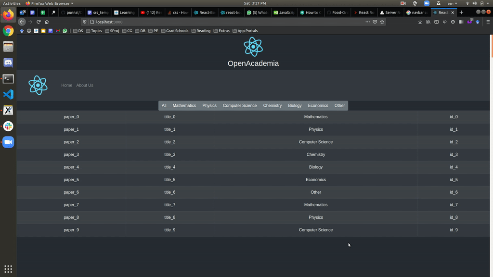

# OpenAcademia :books:
Openacademia is a new system that would encourage authors to archive their research papers. It would not only give researchers full access to the papers online but also allow them to download them and make use of it while being offline. Users can also post a detailed review or respond to some other user’s review.

# Latest Demo

# Use Case Status
Use Case | Status
------------ | :------------:
View about us page | :heavy_check_mark:
Filter papers by category | :heavy_check_mark:
Sign in | :x:
Sign up | :x:
Write reviews | :x:
Response to a review | :x:
Delete a review/response | :x:
Edit a review/response | :x:
Search papers by author name | :x:
Search papers by title | :x:
Search papers by conference | :x:
Sort by date | :x:
Filter by date | :x:
Download paper | :x: 
Change password | :x:
Upload paper | :x:
View author’s own papers | :x:
Delete papers | :x:
Edit paper details | :x:
